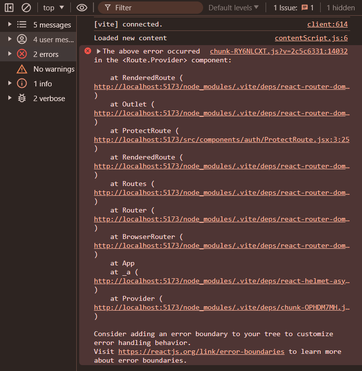

# Error

## ChatterBox Error

MyCode:

```javascript
import React, { lazy } from "react";
import { BrowserRouter, Routes, Route } from "react-router-dom";
import ProtectRoute from "./components/auth/ProtectRoute";

const Home = lazy(() => import("./pages/Home"));
const Login = lazy(() => import("./pages/Login"));
const Chat = lazy(() => import("./pages/Chat"));
const Groups = lazy(() => import("./pages/Groups"));
const NotFound = lazy(() => import("./pages/NotFound"));

let user = true;

function App() {
  return (
    <BrowserRouter>
      <Routes>
        <Route element={<ProtectRoute user={user} />}>
          <Route path="/" element={<Home />} />
          <Route path="/chat/:chatId" element={<Chat />} />
          <Route path="/groups" element={<Groups />} />
        </Route>

        <Route
          path="/login"
          element={
            <ProtectRoute user={!user} redirect="/">
              <Login />
            </ProtectRoute>
          }
        />
        <Route path="*" element={<NotFound />} />
      </Routes>
    </BrowserRouter>
  );
}

export default App;


```

Error:




How it solve:

```markdown
# React Router with Lazy Loading and Protected Routes Example

This example demonstrates how to set up React Router with lazy loading for components and protected routes using authentication logic.

### Correct Code `App.js`

```jsx
import React, { lazy, Suspense } from "react";
import { BrowserRouter, Routes, Route } from "react-router-dom";
import ProtectRoute from "./components/auth/ProtectRoute";

const Home = lazy(() => import("./pages/Home"));
const Login = lazy(() => import("./pages/Login"));
const Chat = lazy(() => import("./pages/Chat"));
const Groups = lazy(() => import("./pages/Groups"));
const NotFound = lazy(() => import("./pages/NotFound"));

let user = true; // Set your authentication logic here

function App() {
  return (
    <BrowserRouter>
      <Suspense fallback={<div>Loading...</div>}>
        <Routes>
          <Route element={<ProtectRoute user={user} />}>
            <Route path="/" element={<Home />} />
            <Route path="/chat/:chatId" element={<Chat />} />
            <Route path="/groups" element={<Groups />} />
          </Route>
          <Route
            path="/login"
            element={
              <ProtectRoute user={!user} redirect="/">
                <Login />
              </ProtectRoute>
            }
          />
          <Route path="*" element={<NotFound />} />
        </Routes>
      </Suspense>
    </BrowserRouter>
  );
}

export default App;
```

### Instructions:

1. **App.js**: This file sets up the main routing structure using `react-router-dom`. Lazy loading is implemented using `React.lazy()` for code splitting and improved performance. The `ProtectRoute` component ensures that certain routes are protected based on the `user` authentication status.

2. **ProtectRoute.js**: This component handles the logic for protecting routes based on the `user` prop. If the user is not authenticated (`user=false`), it redirects to the login page (`redirect="/login"`).

### Notes:

- Adjust the `user` variable logic (`let user = true;`) based on your application's authentication mechanism.
- Ensure all imported components (`Home`, `Login`, `Chat`, `Groups`, `NotFound`) are correctly exported and located in their respective files.

